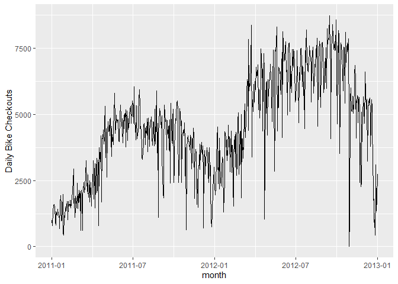
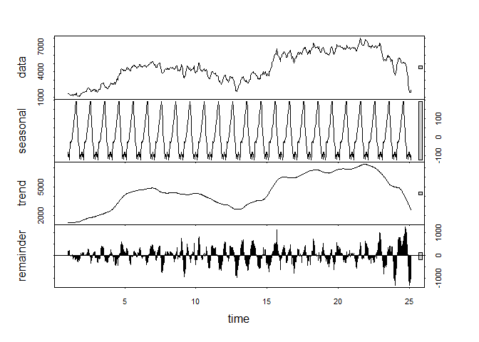
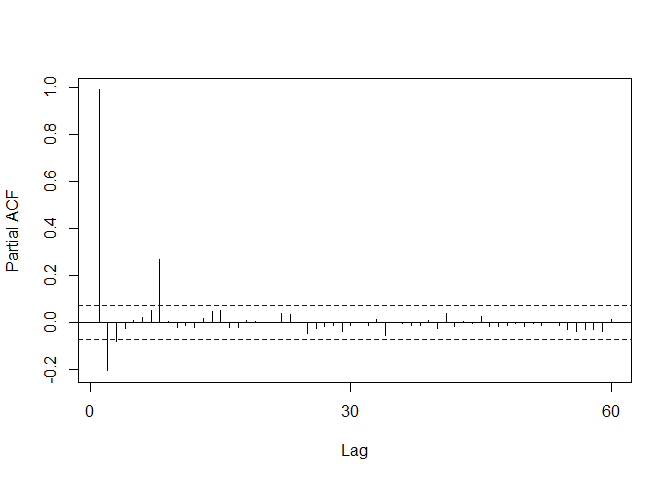
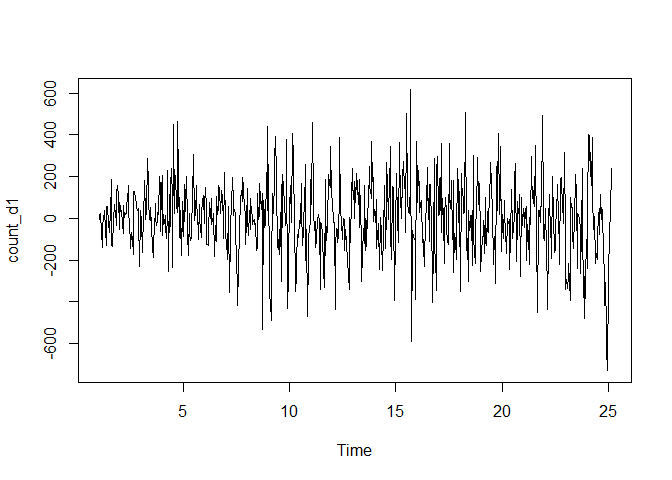
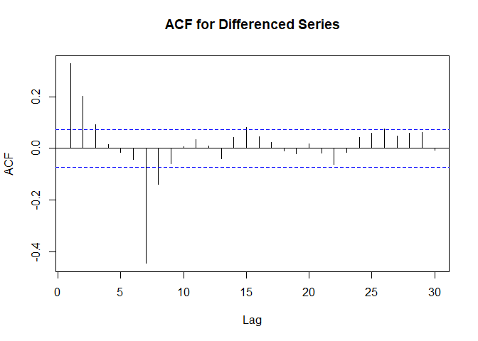
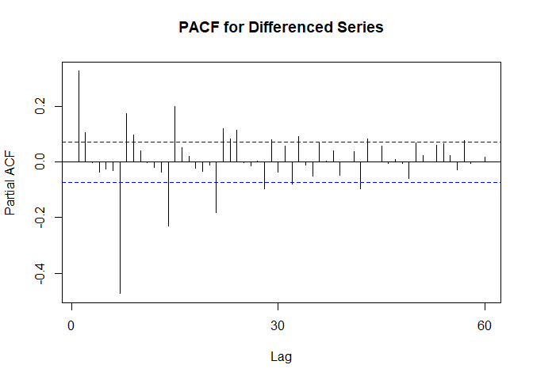
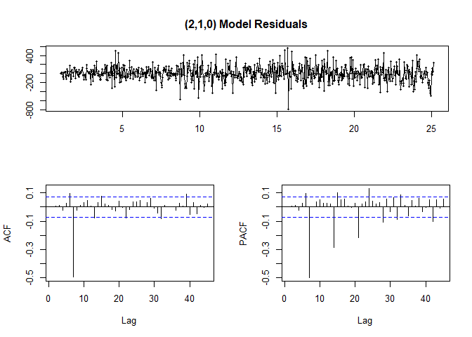
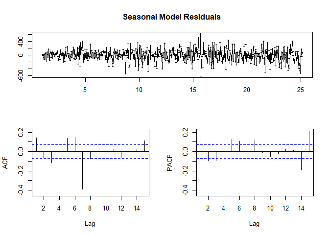
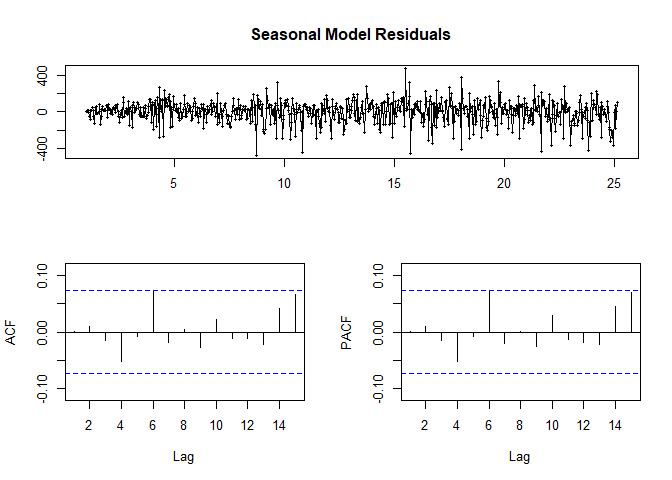
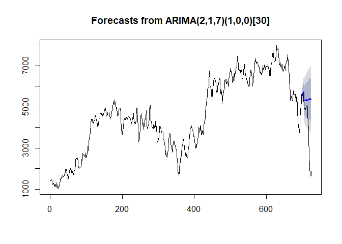

bike
================

<https://www.datascience.com/blog/introduction-to-forecasting-with-arima-in-r-learn-data-science-tutorials>

``` r
library('ggplot2')
library('forecast')
library('tseries')
```

### Step1: Import data

We start out by reading in the analysis dataset. Here we are using a
dataset on the number of bicycles checkouts from a bike sharing service,
which is available as part of the UCI Machine Learning Repository. We
will be using the dataset aggregated at daily
level.

``` r
daily_data = read.csv('./Bike-Sharing-Dataset/day.csv', header=TRUE, stringsAsFactors=FALSE)
```

### Step 2: Examine Your Data

A good stating point is to plot the series and visually examine it for
any outliers, volatility, or irregularities. In this case, bicycle
checkouts are showing a lot of fluctuations from one day to another.
However, even with this volatility present, we already see some patterns
emerge. For example, lower usage of bicycles occurs in the winter months
and higher checkout numbers are observed in the summer months:

``` r
daily_data$Date = as.Date(daily_data$dteday)

ggplot(daily_data, aes(Date, cnt)) + geom_line() + scale_x_date('month')  + ylab("Daily Bike Checkouts") +
            xlab("")
```

<!-- -->

In some cases, the number of bicycles checked out dropped below 100 on
day and rose to over 4,000 the next day. These are suspected outliers
that could bias the model by skewing statistical summaries. R provides a
convenient method for removing time series outliers: tsclean() as part
of its forecast package. tsclean() identifies and replaces outliers
using series smoothing and decomposition.

This method is also capable of inputing missing values in the series if
there are any.Note that we are using the ts() command to create a time
series object to pass to tsclean():

``` r
count_ts = ts(daily_data[, c('cnt')])

daily_data$clean_cnt = tsclean(count_ts)

ggplot() +
  geom_line(data = daily_data, aes(x = Date, y = clean_cnt)) + ylab('Cleaned Bicycle Count')
```

    ## Don't know how to automatically pick scale for object of type ts. Defaulting to continuous.

<!-- -->

Even after removing outliers, the daily data is still pretty volatile.
Visually, we could a draw a line through the series tracing its bigger
troughs and peaks while smoothing out noisy fluctuations. This line can
be described by one of the simplest — but also very useful —concepts in
time series analysis known as a moving average. It is an intuitive
concept that averages points across several time periods, thereby
smoothing the observed data into a more stable predictable series.

**Note that the moving average in this context is distinct from the M
A(q) component in the above ARIMA definition**. Moving average M A(q) as
part of the ARIMA framework refers to error lags and combinations,
whereas the summary statistic of moving average refers to a data
smoothing
technique.

``` r
daily_data$cnt_ma = ma(daily_data$clean_cnt, order=7) # using the clean count with no outliers
daily_data$cnt_ma30 = ma(daily_data$clean_cnt, order=30)


ggplot() +
  geom_line(data = daily_data, aes(x = Date, y = clean_cnt, colour = "Counts")) +
  geom_line(data = daily_data, aes(x = Date, y = cnt_ma,   colour = "Weekly Moving Average"))  +
  geom_line(data = daily_data, aes(x = Date, y = cnt_ma30, colour = "Monthly Moving Average"))  +
  ylab('Bicycle Count')
```

    ## Don't know how to automatically pick scale for object of type ts. Defaulting to continuous.

    ## Warning: Removed 6 rows containing missing values (geom_path).

    ## Warning: Removed 30 rows containing missing values (geom_path).

<!-- -->

In addition to volatility, modeling daily level data might require
specifying multiple seasonality levels, such day of the week, week of
the year, month of the year, holidays, etc. For the sake of simplicity,
we will model the smoothed series of weekly moving average (as shown by
the blue line above).

### Step 3: Decompose Your Data

The building blocks of a time series analysis are seasonality, trend,
and cycle. These intuitive components capture the historical patterns in
the series. Not every series will have all three (or any) of these
components, but if they are present, deconstructing the series can help
you understand its behavior and prepare a foundation for building a
forecasting model.

Seasonal component refers to fluctuations in the data related to
calendar cycles. For example, more people might be riding bikes in the
summer and during warm weather, and less during colder months. Usually,
seasonality is fixed at some number; for instance, quarter or month of
the year.

Trend component is the overall pattern of the series: Is the number of
bikes rented increasing or decreasing over time?

Cycle component consists of decreasing or increasing patterns that are
not seasonal. Usually, trend and cycle components are grouped together.
Trend-cycle component is estimated using moving averages.

Finally, part of the series that can’t be attributed to seasonal, cycle,
or trend components is referred to as residual or error.

Formally, if Y is the number of bikes rented, we can decompose the
series in two ways: by using either an additive or multiplicative model,

\[Y = S_t + T_t + E_t\]\[Y = S_t * T_t * E_t\]

where St is the seasonal component, T is trend and cycle, and E is the
remaining error.

An additive model is usually more appropriate when the seasonal or trend
component is not proportional to the level of the series, as we can just
overlay (i.e. add) components together to reconstruct the series. On the
other hand, if the seasonality component changes with the level or trend
of the series, a simple “overlay,” or addition of components, won’t be
sufficient to reconstruct the series. In that case, a multiplicative
model might be more appropriate.

As mentioned above, ARIMA models can be fitted to both seasonal and
non-seasonal data. Seasonal ARIMA requires a more complicated
specification of the model structure, although the process of
determining (P, D, Q) is similar to that of choosing non-seasonal order
parameters. Therefore, we will explore how to de-seasonalize the series
and use a “vanilla” non-seasonal ARIMA model.

First, we calculate seasonal component of the data using stl(). STL is a
flexible function for decomposing and forecasting the series. It
calculates the seasonal component of the series using smoothing, and
adjusts the original series by subtracting seasonality in two simple
lines:

``` r
count_ma = ts(na.omit(daily_data$cnt_ma), frequency=30)
decomp = stl(count_ma, s.window="periodic")
deseasonal_cnt <- seasadj(decomp)
plot(decomp)
```

<!-- -->

Note that stl() by default assumes additive model structure. Use
allow.multiplicative.trend=TRUE to incorporate the multiplicative model.

In the case of additive model structure, the same task of decomposing
the series and removing the seasonality can be accomplished by simply
subtracting the seasonal component from the original series. seasadj()
is a convenient method inside the forecast package.

As for the frequency parameter in ts() object, we are specifying
periodicity of the data, i.e., number of observations per period. Since
we are using smoothed daily data, we have 30 observations per month.

### Step 4: Stationarity

Fitting an ARIMA model requires the series to be stationary. A series is
said to be stationary when its mean, variance, and autocovariance are
time invariant. This assumption makes intuitive sense: Since ARIMA uses
previous lags of series to model its behavior, modeling stable series
with consistent properties involves less uncertainty. The left panel
below shows an example of a stationary series, where data values
oscillate with a steady variance around the mean of 1. The panel on the
right shows a non-stationary series; mean of this series will differ
across different time
windows.


The augmented Dickey-Fuller (ADF) test is a formal statistical test for
stationarity. The null hypothesis assumes that the series is
non-stationary. ADF procedure tests whether the change in Y can be
explained by lagged value and a linear trend. If contribution of the
lagged value to the change in Y is non-significant and there is a
presence of a trend component, the series is non-stationary and null
hypothesis will not be rejected. Our bicycle data is non-stationary; the
average number of bike checkouts changes through time, levels change,
etc. A formal ADF test does not reject the null hypothesis of
non-stationarity, confirming our visual
    inspection:

``` r
adf.test(count_ma, alternative = "stationary")
```

    ## Warning in adf.test(count_ma, alternative = "stationary"): p-value greater
    ## than printed p-value

    ## 
    ##  Augmented Dickey-Fuller Test
    ## 
    ## data:  count_ma
    ## Dickey-Fuller = -0.2557, Lag order = 8, p-value = 0.99
    ## alternative hypothesis: stationary

Usually, non-stationary series can be corrected by a simple
transformation such as differencing. Differencing the series can help in
removing its trend or cycles. The idea behind differencing is that, if
the original data series does not have constant properties over time,
then the change from one period to another might. The difference is
calculated by subtracting one period’s values from the previous period’s
values: \[Y_{d_t} = Y_t - Y_{t-1}\] Higher order differences are
calculated in a similar fashion. For example, second order differencing
(d = 2) is simply expanded to include second lag of the
series:

\[Y_{d2_t} = Y_{d_t} - Y_{d_t-1} = (Y_t - Y_{t-1}) - (Y_{t-1} - Y_{t-2})\]

Similarly, differencing can be used if there is a seasonal pattern at
specific lags. In such a case, subtracting a value for the “season” from
a previous period represents the change from one period to another, as
well as from one season to another:

\[Y_{d_t} = (Y_t - Y_{t-s}) - (Y_{t-1} - Y_{t-s-1} )\]

The number of differences performed is represented by the d component of
ARIMA. Now, we move on to diagnostics that can help determine the order
of differencing.

### Step 5: Autocorrelations and Choosing Model Order

Autocorrelation plots (also known as ACF or the auto correlation
function) are a useful visual tool in determining whether a series is
stationary. These plots can also help to choose the order parameters for
ARIMA model. If the series is correlated with its lags then, generally,
there are some trend or seasonal components and therefore its
statistical properties are not constant over time.

ACF plots display correlation between a series and its lags. In addition
to suggesting the order of differencing, ACF plots can help in
determining the order of the M A (q) model. Partial autocorrelation
plots (PACF), as the name suggests, display correlation between a
variable and its lags that is not explained by previous lags. PACF plots
are useful when determining the order of the AR(p) model.

R plots 95% significance boundaries as blue dotted lines. There are
significant autocorrelations with many lags in our bike series, as shown
by the ACF plot below. However, this could be due to carry-over
correlation from the first or early lags, since the PACF plot only shows
a spike at lags 1 and 7:

``` r
Acf(count_ma, main='')
```

<!-- -->

``` r
Pacf(count_ma, main='')
```

<!-- -->

We can start with the order of d = 1 and re-evaluate whether further
differencing is needed.

The augmented Dickey-Fuller test on differenced data rejects the null
hypotheses of non-stationarity. Plotting the differenced series, we see
an oscillating pattern around 0 with no visible strong trend. This
suggests that differencing of order 1 terms is sufficient and should be
included in the model.

``` r
count_d1 = diff(deseasonal_cnt, differences = 1)
plot(count_d1)
```

<!-- -->

``` r
adf.test(count_d1, alternative = "stationary")
```

    ## Warning in adf.test(count_d1, alternative = "stationary"): p-value smaller
    ## than printed p-value

    ## 
    ##  Augmented Dickey-Fuller Test
    ## 
    ## data:  count_d1
    ## Dickey-Fuller = -9.9255, Lag order = 8, p-value = 0.01
    ## alternative hypothesis: stationary

Next, spikes at particular lags of the differenced series can help
inform the choice of p or q for our model:

``` r
Acf(count_d1, main='ACF for Differenced Series', lag.max = 30)
```

<!-- -->

``` r
Pacf(count_d1, main='PACF for Differenced Series')
```

<!-- -->

There are significant auto correlations at lag 1 and 2 and beyond.
Partial correlation plots show a significant spike at lag 1 and 7. This
suggests that we might want to test models with AR or MA components of
order 1, 2, or 7. A spike at lag 7 might suggest that there is a
seasonal pattern present, perhaps as day of the week. We talk about how
to choose model order in the next step.

### Step 6: Fitting an ARIMA model

Now let’s fit a model. The forecast package allows the user to
explicitly specify the order of the model using the arima() function, or
**automatically generate a set of optimal (p, d, q) using
auto.arima()**. This function searches through combinations of order
parameters and picks the set that optimizes model fit criteria.

There exist a number of such criteria for comparing quality of fit
across multiple models. Two of the most widely used are Akaike
information criteria (AIC) and Baysian information criteria (BIC). These
criteria are closely related and can be interpreted as an estimate of
how much information would be lost if a given model is chosen. When
comparing models, one wants to minimize AIC and BIC.

While auto.arima() can be very useful, it is still important to complete
steps 1-5 in order to understand the series and interpret model results.
Note that auto.arima() also allows the user to specify maximum order for
(p, d, q), which is set to 5 by default.

We can specify non-seasonal ARIMA structure and fit the model to
**de-seasonalize** data. Parameters (2,1,0) suggested by the automated
procedure are in line with our expectations based on the steps above;
the model incorporates differencing of degree 1, and uses an
autoregressive term of second lag and no MA term:

``` r
auto.arima(deseasonal_cnt, seasonal=FALSE)
```

    ## Series: deseasonal_cnt 
    ## ARIMA(2,1,0) 
    ## 
    ## Coefficients:
    ##          ar1     ar2
    ##       0.2929  0.1055
    ## s.e.  0.0370  0.0370
    ## 
    ## sigma^2 estimated as 26137:  log likelihood=-4708.32
    ## AIC=9422.64   AICc=9422.68   BIC=9436.4

Using the ARIMA notation introduced above, the fitted model can be
written as

\[ \hat Y_{d_t} = 0.2929 Y_{t-1} + 0.1055 Y_{t-2} + E\]

where E is some error and the original series is differenced with order
1.

### Step 7: Evaluate and Iterate

So now we have fitted a model that can produce a forecast, but does it
make sense? Can we trust this model? We can start by examining ACF and
PACF plots for model residuals. If model order parameters and structure
are correctly specified, we would expect no significant autocorrelations
present.

``` r
fit<-auto.arima(deseasonal_cnt, seasonal=FALSE)
tsdisplay(residuals(fit), lag.max=45, main='(2,1,0) Model Residuals')
```

<!-- -->

There is a clear pattern present in ACF/PACF and model residuals plots
repeating at lag 7. This suggests that our model may be better off with
a different specification, such as p = 7 or q = 7.

We can repeat the fitting process allowing for the MA(7) component and
examine diagnostic plots again. This time, there are no significant
autocorrelations present. If the model is not correctly specified, that
will usually be reflected in residuals in the form of trends, skeweness,
or any other patterns not captured by the model. Ideally, residuals
should look like white noise, meaning they are normally distributed. A
convenience function tsdisplay() can be used to plot these model
diagnostics. Residuals plots show a smaller error range, more or less
centered around 0. We can observe that AIC is smaller for the (2, 1, 0)
structure as well:

``` r
fit2 = arima(deseasonal_cnt, order=c(2,1,7))

fit2
```

    ## 
    ## Call:
    ## arima(x = deseasonal_cnt, order = c(2, 1, 7))
    ## 
    ## Coefficients:
    ##         ar1     ar2     ma1     ma2     ma3     ma4     ma5     ma6
    ##       0.282  0.0351  0.1380  0.1410  0.1151  0.1117  0.1196  0.1388
    ## s.e.  0.047  0.0435  0.0295  0.0286  0.0286  0.0286  0.0270  0.0273
    ##           ma7
    ##       -0.8442
    ## s.e.   0.0298
    ## 
    ## sigma^2 estimated as 14377:  log likelihood = -4502.95,  aic = 9025.91

``` r
tsdisplay(residuals(fit2), lag.max=15, main='Seasonal Model Residuals')
```

<!-- -->

Forecasting using a fitted model is straightforward in R. We can specify
forecast horizon h periods ahead for predictions to be made, and use the
fitted model to generate those predictions:

``` r
fcast <- forecast(fit2, h=30)
plot(fcast)
```

<!-- -->

The light blue line above shows the fit provided by the model, but what
if we wanted to get a sense of how the model will perform in the future?
One method is to reserve a portion of our data as a “hold-out” set, fit
the model, and then compare the forecast to the actual observed values:

``` r
hold <- window(ts(deseasonal_cnt), start=700)

fit_no_holdout = arima(ts(deseasonal_cnt[-c(700:725)]), order=c(2,1,7))

fcast_no_holdout <- forecast(fit_no_holdout,h=25)
plot(fcast_no_holdout)
lines(ts(deseasonal_cnt))
```

<!-- -->

However, the blue line representing forecast seems very naive: It goes
close to a straight line fairly soon, which seems unlikely given past
behavior of the series. Recall that the model is assuming a series with
no seasonality, and is differencing the original non-stationary data. In
other words, plotted predictions are based on the assumption that there
will be no other seasonal fluctuations in the data and the change in
number of bicycles from one day to another is more or less constant in
mean and variance. This forecast may be a naive model, but it
illustrates the process of choosing an ARIMA model and could also serve
as a benchmark to grade against as more complex models are built.

How can we improve the forecast and iterate on this model? One simple
change is to add back the seasonal component we extracted earlier.
Another approach would be to allow for (P, D, Q) components to be
included to the model, which is a default in the auto.arima() function.
Re-fitting the model on the same data, we see that there still might be
some seasonal pattern in the series, with the seasonal component
described by AR(1):

``` r
fit_w_seasonality = auto.arima(deseasonal_cnt, seasonal=TRUE)
fit_w_seasonality
```

    ## Series: deseasonal_cnt 
    ## ARIMA(2,1,2)(1,0,0)[30] 
    ## 
    ## Coefficients:
    ##          ar1      ar2      ma1     ma2    sar1
    ##       1.3644  -0.8027  -1.2903  0.9146  0.0100
    ## s.e.  0.0372   0.0347   0.0255  0.0202  0.0388
    ## 
    ## sigma^2 estimated as 24810:  log likelihood=-4688.59
    ## AIC=9389.17   AICc=9389.29   BIC=9416.68

``` r
seas_fcast <- forecast(fit_w_seasonality, h=30)
plot(seas_fcast)
```

<!-- -->

``` r
tsdisplay(residuals(fit_w_seasonality), lag.max=15, main='Seasonal Model Residuals')
```

<!-- -->

**Note that (p,d,q) parameters also changed after we included a seasonal
component**. We can go through the same process of evaluating model
residuals and ACF/PACF plots and adjusting the structure if necessary.
For example, we notice the same evidence of higher order is present in
the auto correlations with lag 7, which suggests that a higher-order
component might be needed:

  - Tried increasing the power of P and Q in seasonal term, but didn’t
    help much.

  - Turned out increasing the power of p and q of the non-seasonal part
    helped a
lot.

<!-- end list -->

``` r
fit_w_seasonality_2 <- arima(deseasonal_cnt, order=c(2,1,7), seasonal = list(order = c(1, 0, 0), period = 30))
fit_w_seasonality_2
```

    ## 
    ## Call:
    ## arima(x = deseasonal_cnt, order = c(2, 1, 7), seasonal = list(order = c(1, 0, 
    ##     0), period = 30))
    ## 
    ## Coefficients:
    ##          ar1     ar2     ma1     ma2     ma3     ma4     ma5     ma6
    ##       0.2811  0.0337  0.1391  0.1431  0.1166  0.1131  0.1202  0.1395
    ## s.e.  0.0471  0.0437  0.0298  0.0293  0.0289  0.0289  0.0271  0.0274
    ##           ma7     sar1
    ##       -0.8431  -0.0140
    ## s.e.   0.0299   0.0398
    ## 
    ## sigma^2 estimated as 14375:  log likelihood = -4502.89,  aic = 9027.79

``` r
tsdisplay(residuals(fit_w_seasonality_2), lag.max=15, main='Seasonal Model Residuals')
```

<!-- -->

``` r
hold <- window(ts(deseasonal_cnt), start=700)

fit_w_seasonality_2_no_holdout = arima(ts(deseasonal_cnt[-c(700:725)]), order=c(2,1,7), seasonal = list(order = c(1, 0, 0), period = 30))

fcast_no_holdout <- forecast(fit_w_seasonality_2_no_holdout,h=25)
plot(fcast_no_holdout)
lines(ts(deseasonal_cnt))
```

<!-- -->

Both forecast estimates above are provided with confidence bounds: 80%
confidence limits shaded in darker blue, and 95% in lighter blue. Longer
term forecasts will usually have more uncertainty, as the model will
regress future Y on previously predicted values. This is reflected in
the shape of the confidence bounds in this case, as they start to widen
with increasing horizon. The pattern in confidence bounds may signal the
need for a more stable model. It is very important to look at prediction
bounds and keep in mind the expected error associated with point
estimates.

After an initial naive model is built, it’s natural to wonder how to
improve on it. Other forecasting techniques, such as exponential
smoothing, would help make the model more accurate using a weighted
combinations of seasonality, trend, and historical values to make
predictions. In addition, daily bicycle demand is probably highly
dependent on other factors, such weather, holidays, time of the day,
etc. One could try fitting time series models that allow for inclusion
of other predictors using methods such ARMAX or dynamic regression.
These more complex models allow for control of other factors in
predicting the time series.

To summarize, the procedure outlined in this tutorial is an introduction
to ARIMA modeling. Material here can be used as a general guideline to
examining your series, using ACF and PACF plots to choose model order,
and fitting the model in R.
